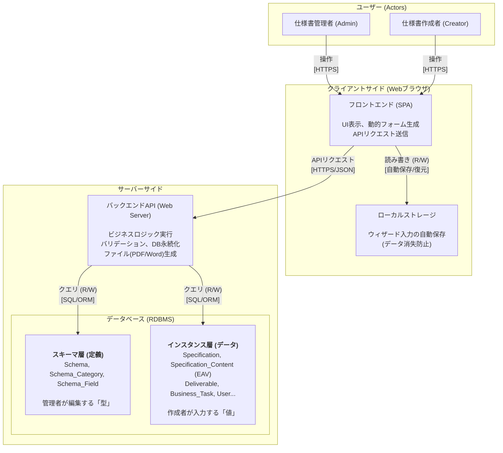

システム構成図: 仕様書作成支援アプリ
===

```mermaid
graph TD
    subgraph "ユーザー (Actors)"
        Admin["仕様書管理者 (Admin)"]
        Creator["仕様書作成者 (Creator)"]
    end

    subgraph "クライアントサイド (Webブラウザ)"
        Frontend["フロントエンド (SPA)<br><br>UI表示、動的フォーム生成<br>APIリクエスト送信"]
        LocalStorage["ローカルストレージ<br><br>ウィザード入力の自動保存<br>(データ消失防止)"]
        
        Frontend -- "読み書き (R/W)<br>[自動保存/復元]" --> LocalStorage
    end

    subgraph "サーバーサイド"
        Backend["バックエンドAPI (Web Server)<br><br>ビジネスロジック実行<br>バリデーション、DB永続化<br>ファイル(PDF/Word)生成"]
        
        subgraph "データベース (RDBMS)"
            dbSchema["<br><b>スキーマ層 (定義)</b><br>Schema, Schema_Category, Schema_Field<br><br>管理者が編集する「型」"]
            dbInstance["<br><b>インスタンス層 (データ)</b><br>Specification, Specification_Content (EAV)<br>Deliverable, Business_Task, User...<br><br>作成者が入力する「値」"]
        end
        
        Backend -- "クエリ (R/W)<br>[SQL/ORM]" --> dbInstance
        Backend -- "クエリ (R/W)<br>[SQL/ORM]" --> dbSchema
    end

    %% --- 接続 ---
    Admin -- "操作<br>[HTTPS]" --> Frontend
    Creator -- "操作<br>[HTTPS]" --> Frontend

    Frontend -- "APIリクエスト<br>[HTTPS/JSON]" --> Backend
```
